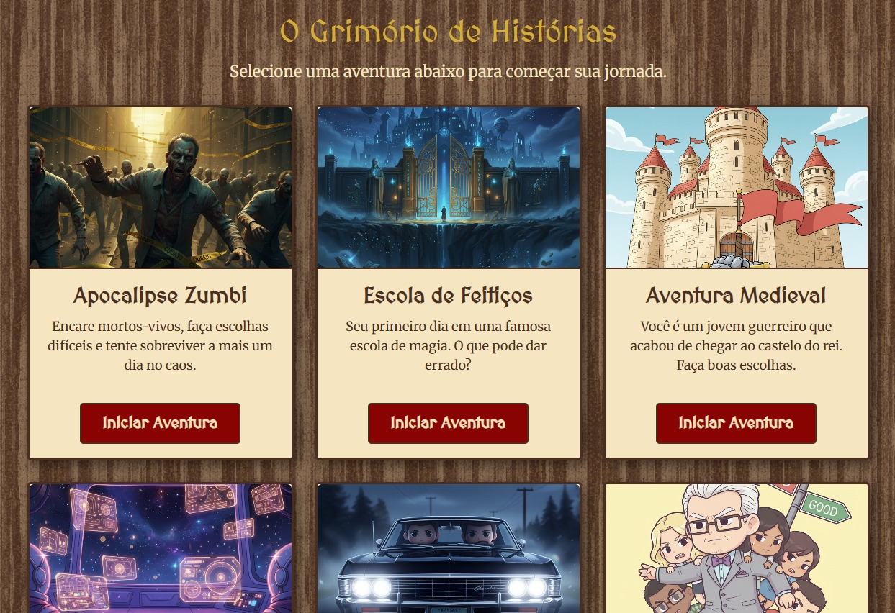

# 🗡️ Escolha Sua Aventura - O Grimório de Histórias

> **Uma plataforma de RPG interativo modular, onde cada história ganha vida com temas visuais, lógica e atmosferas únicas.**

Este projeto vai além de um simples jogo de texto. É um sistema robusto desenvolvido em **JavaScript Vanilla** e **Bootstrap 5** que permite criar múltiplas aventuras interativas, cada uma com sua própria identidade visual, mecânicas e narrativa, compartilhando um núcleo de código eficiente e escalável.

---

## 🎨 Interface e Imersão

 

O projeto foi totalmente refatorado para oferecer uma experiência imersiva:

* **Menu Principal Temático:** Uma interface estilo "Grimório" ou "Mesa de Taverna" para seleção de aventuras.
* **Temas Visuais Únicos:** Cada aventura carrega seu próprio arquivo CSS (`zumbi.css`, `espacial.css`, etc.), alterando cores, fontes (Google Fonts) e texturas de fundo para combinar com a narrativa.
* **Assets Dinâmicos:** O sistema carrega imagens de cena e descrições contextuais para cada passo da jornada.

---

## 🛠️ Tecnologias e Arquitetura

   

### O Segredo: Arquitetura "Base + Tema"

O projeto utiliza uma arquitetura de Front-End inteligente para evitar repetição de código:

1.  **`game-base.css` (O Esqueleto):** Um arquivo CSS central que define o layout estrutural (grids, responsividade, posicionamento) comum a *todos* os jogos.
2.  **Arquivos de Tema (A Pele):** Cada aventura possui um arquivo `.css` específico que sobrescreve as variáveis de cor (`:root`) e aplica fontes personalizadas sobre o esqueleto base.
3.  **Lógica Modular:** Os dados da história (`data.js`) são separados da lógica de controle (`main.js` / `zumbi.js`), facilitando a criação de novas aventuras sem tocar no código principal.

---

### 📂 Estrutura de Pastas
```
escolha-sua-aventura/
│
├── index.html              # Menu Principal (Interface do Grimório)
├── style.css               # Estilos do Menu Principal (Cores, Navbar, Cards)
├── main.js               # Lógica do Menu (Cards das Aventuras)
├── game-base.css           # 🦴 ESQUELETO COMPARTILHADO (Layout base para todas as aventuras)
│
├── assets/                 # Recursos Globais das Aventuras
│   ├── img/                # Favicon e imagens de capa
│
└── adventures/             # 🌍 Módulos de Aventura (Cada pasta é um jogo completo)
    │
    ├── zumbi/              # Tema: Terror / Sobrevivência
    │   ├── zumbi.html      # O Palco (HTML)
    │   ├── zumbi.css       # O Tema (Visual Escuro)
    │   ├── zumbi.js        # O Motor (Lógica)
    │   ├── data.js         # A História (Dados)
    │   └── img/            # Imagens de Cena
    │
    ├── medieval/           # Tema: Fantasia / Épico
    │   ├── medieval.html
    │   ├── medieval.css    
    │   ├── medieval.js
    │   ├── data.js
    │   └── img/
    │
    ├── espacial/           # Tema: Sci-Fi / Neon
    │   ├── espacial.html
    │   ├── espacial.css   
    │   ├── espacial.js
    │   ├── data.js
    │   └── img/
    │
    ├── caca-da-noite/      # Tema: Sobrenatural / Investigação
    │   ├── caca-da-noite.html
    │   ├── caca-da-noite.css
    │   ├── caca-da-noite.js # Motor com Sistema de Inventário/Pistas
    │   ├── data.js
    │   └── img/
    │
    ├── good-place/         # Tema: Ética / Pontos
    │   ├── good-place.html
    │   ├── good-place.css
    │   ├── good-place.js   # Motor com Sistema de Pontos e Julgamento
    │   ├── data.js
    │   └── img/
    │
    └── circo-misterioso/   # Tema: Terror Psicológico / Vintage
        ├── ... (Arquivos padrão)
        └── img/
```

> 🤖 Nota sobre os **Assets Visuais**: Para criar uma **experiência imersiva e ágil**, todas as **imagens de cena e capas** utilizadas dentro das aventuras interativas foram **geradas utilizando Inteligência Artificial (Google Gemini)**, demonstrando o **uso de IA como ferramenta de apoio na prototipagem e desenvolvimento de narrativas visuais**. 

---

## 🚀 Funcionalidades Avançadas

Além das escolhas ramificadas, o sistema suporta mecânicas complexas dependendo da aventura:

* **🌲 Árvores de Decisão:** Fluxos não lineares com múltiplos finais (Vitória, Derrota, Finais Secretos).
* **🎒 Sistema de Inventário:** Coleta de pistas e itens que influenciam opções futuras (ex: *Caça da Noite*).
* **⚖️ Sistema de Moralidade:** Rastreamento de pontos e "flags" de comportamento que determinam o julgamento final (ex: *The Good Place*).
* **🎲 Lógica Condicional:** Opções que só aparecem se o jogador tiver certas informações ou itens.

---

## 📖 Aventuras Disponíveis

| Aventura | Tema Visual | Mecânica Destaque |
| :--- | :--- | :--- |
| **🧟 Apocalipse Zumbi** | Terror / Escuro | Sobrevivência e Fuga Rápida |
| **⚔️ Aventura Medieval** | Pergaminho / Épico | Diplocracia e Combate |
| **🚀 Missão Espacial** | Sci-Fi / Neon | Gestão de Crise e Tecnologia |
| **✨ The (Almost) Good Place** | Limpo / Utópico | **Sistema de Pontos Morais e Julgamento** |
| **👻 Caça da Noite** | Sobrenatural / Investigação | **Sistema de Coleta de Pistas (Inventário)** |
| **🎪 Circo Misterioso** | Vintage / Bizarro | Terror Psicológico |

---

## 🌐 Jogue Agora

Você pode explorar o grimório e viver todas essas histórias diretamente no navegador:

👉 **[Acessar o RPG - Escolha Sua Aventura](https://emillyandradedev.github.io/rpg-escolha-sua-aventura/)**
